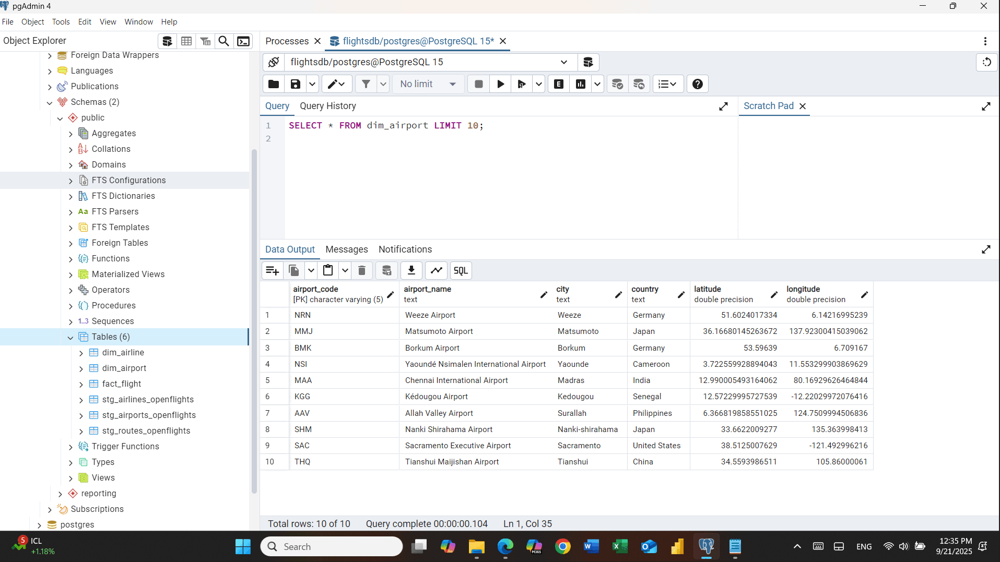

✈️ **Flights SQL Reporting Project**

In this project I built a small flight database from scratch and turned it into a clean reporting layer that’s ready for BI tools.
The idea was to go end-to-end: from raw files → staging tables → dimensions & fact → one reporting view.

## Run

**Prereqs:** PostgreSQL 15+ and base tables exist: `fact_flight`, `dim_airline`, `dim_airport`.

### psql
```bash
psql -h <host> -U <user> -d flightsdb -f sql/reporting_vw_flight_report.sql
psql -h <host> -U <user> -d flightsdb -f sql/indexes.sql
psql -h <host> -U <user> -d flightsdb -f sql/sample_queries.sql

```

🔨 **Steps I took**

Database setup – created a fresh PostgreSQL database for the project.

Staging tables – loaded raw OpenFlights data (airports, airlines) and built flexible stg_* tables with UPSERT logic.

Dimension tables – cleaned and shaped data into dim_airport and dim_airline.

Fact table – created fact_flight with sample flight data: airline code, origin/destination, scheduled & actual times (HHMM), delays, cancellations, distance, etc.

Reporting view – combined everything into reporting.vw_flight_report:

Converted HHMM values (like 700, 2359) into proper SQL time.

Joined flights with airlines and airports by their codes.

Produced one flat, easy-to-use dataset with all details in one place.

**Screenshots**




✅ **Why it’s useful**

Instead of juggling multiple tables with messy time formats, now there’s a single, tidy view that shows:
Airline → Departure → Arrival → Times → Delays → Cancellations → Distance.
Perfect for connecting directly to tools like Power BI.
